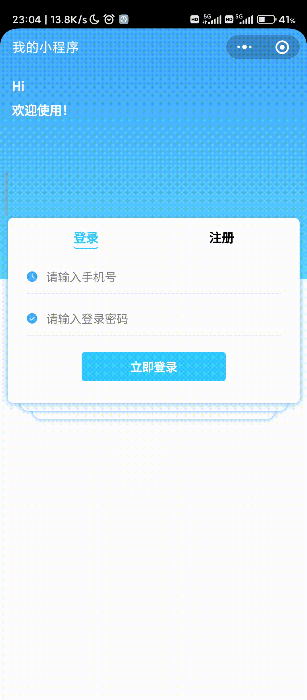
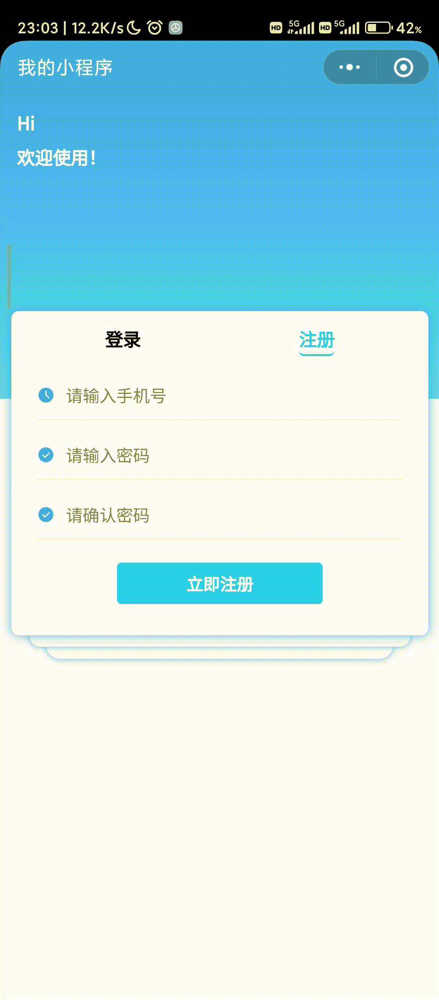
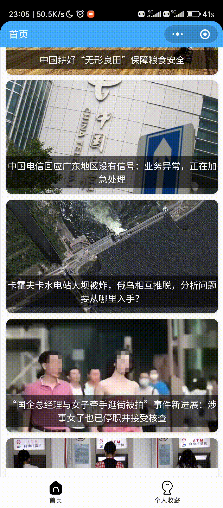
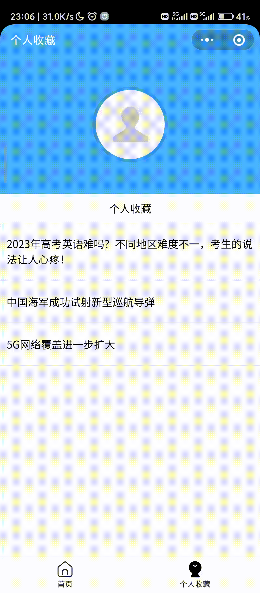

# miniprogram-News
北京交通大学 轻量化平台开发 新闻讯息小程序

实现一个新闻展示网站

# 功能实现

## 基础

### 登录注册页

- [ ] 登录
- [ ] 注册

### 新闻展示页

- [ ] 新闻类别选择
- [ ] 新闻加载与展示
- [ ] 触底加载
- [ ] 下拉刷新

### 新闻详情页

- [ ] 返回键切换
- [ ] 收藏功能
- [ ] 评论功能
- [ ] 触底加载

### 个人收藏新闻页

- [ ] 收藏新闻展示
- [ ] 与新闻展示页的导航栏切换

## Out of Exception

- [x] 登录
- [x] 注册
- [x] 新闻类别选择
- [x] 可以删除自己的评论

# 具体展示

